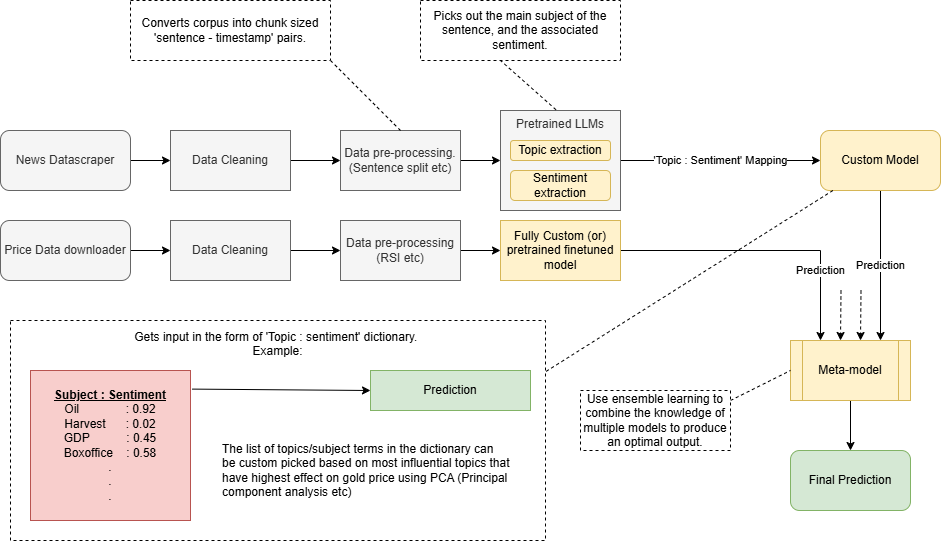

# DA 225o Deep Learning (Summer 2025 Term)
## TEAM 7 - Predicting Gold Price Movement in India Using Financial Sentiment Analysis

> Adithya Jayan | Deepak Kumar | Jaison Fernandez | Mohan P | Prayaga Nagasree Tejashwini | Sai Yaswanth Divvela | Vinjamuru Tarun

---



### Section 1: Introduction and Paper.
This project presents a language model-based automation workflow for forecasting gold price movements in India, leveraging sentiment signals extracted from financial news, stock market data, and technical indicators such as moving averages and RSI. While sentiment-driven models are widely used in equity markets, their application in gold price movement prediction is underexplored.

The proposed methodology orchestrates a system capable of performing data collection, web scraping, preprocessing, sentiment analysis, LLM encoder-based sentiment extraction, and gold price movement assertion. The system includes a custom fine-tuned language model trained locally on domain-specific data, integrated into an orchestration framework for real-time inference. The performance of the model is also benchmarked against standard baseline models.

> The final submitted paper can be found here: [OpenReview](https://openreview.net/forum?id=cP03EBKmqH&noteId=cP03EBKmqH)

### Section 2: Files and repository Structuring. [How to Run]

- Main Langchain based system implementation: [Final_chain](Final/Tarun/Final_Gold_Price_Prediction_Model.ipynb)

- Gui template (Partially integrated): [GUI](Final/Tarun/gui.py)

> All scripts and function definitions used for final implementatio, integration, analysis and testing are available in the [Final/](Final/) directory.

> All exploration, comparitive analysis and experimental testing related code can be found in [Exploration_and_testing/](Exploration_and_testing/)


### Section 3: Code requirements and details.
---
#### Sentiment extraction using finbert

Following are the python library version to run finbert_finetune_mps.py

```
Python version 3.11
```
Trannsformers and Peft versions as below

```
pip show transformers
pip show peft

Name: transformers
Version: 4.41.2
Summary: State-of-the-art Machine Learning for JAX, PyTorch and TensorFlow
Home-page: https://github.com/huggingface/transformers
Author: The Hugging Face team (past and future) with the help of all our contributors (https://github.com/huggingface/transformers/graphs/contributors)
Author-email: transformers@huggingface.co
License: Apache 2.0 License
Location: /Users/mohanpanakam/Library/CloudStorage/OneDrive-IndianInstituteofScience/Python_Projects/venv/lib/python3.11/site-packages
Requires: filelock, huggingface-hub, numpy, packaging, pyyaml, regex, requests, safetensors, tokenizers, tqdm
Required-by: peft
Name: peft
Version: 0.11.1
Summary: Parameter-Efficient Fine-Tuning (PEFT)
Home-page: https://github.com/huggingface/peft
Author: The HuggingFace team
Author-email: sourab@huggingface.co
License: Apache
Location: /Users/mohanpanakam/Library/CloudStorage/OneDrive-IndianInstituteofScience/Python_Projects/venv/lib/python3.11/site-packages
Requires: accelerate, huggingface-hub, numpy, packaging, psutil, pyyaml, safetensors, torch, tqdm, transformers
Required-by: 
```


